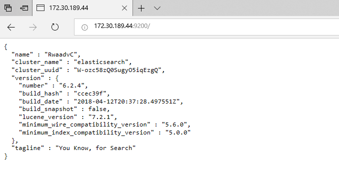
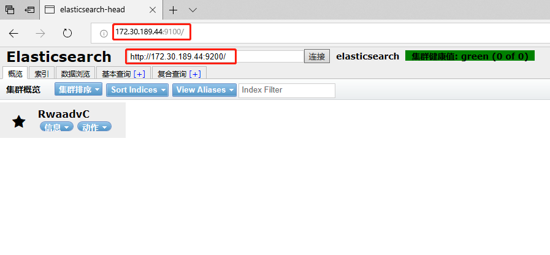

# Log-Analysis
日志分析工具


* 初步完成使用正则方式识别日志中常见的XSS、SQL注入等WEB 攻击类型。

* 分析步骤=> 首先将日志正则归一化处理，之后将日志传入到elasticsearch中进行分析，结果暂时打印到命令行窗口。

## 一、文件说明

|-venv.zip    python运行环境，解压缩后放在项目根目录，运行项目时，需要使用venv里面的python来运行<br/>
|-requirements.txt    python库管理<br/>
|-log         需要将待分析的日志文件放在log文件夹下，日志文件名格式为：域名-access-年月日.log.gz ,如：knownsec.com-access20180625.log.gz<br/>
|-logManage<br/> 
&nbsp;&nbsp;|-&nbsp;logformat.ini  日志归一化配置文件，可以自定义归一化配置，具体编写规范，参照.ini文件编写规范<br/>
|-config<br/>
&nbsp;&nbsp;|-&nbsp;config.ini     报警规则配置文件，可以在原有的大类中编辑rules规则，暂时不支持添加新的大类<br/>
&nbsp;&nbsp;|-&nbsp;task.ini       运行日志分析时产生的.ini文件，每次结束分析任务后，需要手动将其删除<br/>

## 二、Docker镜像

该项目主要架构是将日志文件经过归一化处理之后存放到Elasticsearch中，之后使用Elasticsearch的API对日志进行分析。<br>
本项目配套的Docker下方法为：
```shell
docker pull dockerlucifer/elasticsearch:v1.0.0

#推荐使用DaoCloud加速器来下载，链接：https://www.daocloud.io/mirror#accelerator-doc
```
下载完成docker镜像之后使用images命令浏览docker image列表：
```shell
root@daemonshao:~# docker images
REPOSITORY                    TAG                 IMAGE ID            CREATED             SIZE
dockerlucifer/elasticsearch   v1.0.0              fa1e6efc7c76        2 hours ago         869MB
```
使用docker image创建docker 容器：
```shell
docker run -p 9100:9100 -p 9200:9200 -p 20:20  --privileged -it fa1e6efc7c76 /bin/bash

#备注：9100端口为elasticsearch-head端口 9200为elasticsearch端口 20为ssh端口，主要用于scp使用

#命令格式：docker run -it 【IMAGE ID】 /bin/bash
```

## 三、Docker 容器配置
### 启动elasticsearch 服务
```shell
#注意：elasticsearch会将docker容器中的9100、9200端口映射到宿主机，所以确保自己的主机9100以及9200端口没有被占用
root@59431ac10dd6:~# vim /etc/sysctl.conf

--------sysctl.conf-------------
vm.max_map_count=262144  # 添加一行配置

root@59431ac10dd6:~# sysctl -p

root@59431ac10dd6:~# cd /opt/elasticsearch-6.2.4/
root@59431ac10dd6:/opt/elasticsearch-6.2.4# ls      
LICENSE.txt  NOTICE.txt  README.textile  bin  config  lib  logs  modules  nohup.out  plugins
root@59431ac10dd6:/opt/elasticsearch-6.2.4# su elastic
$ nohup bin/elasticsearch &
```
验证：访问http://【宿主机IP】:9200/  <br/>


### 启动elastic-head
```shell
root@59431ac10dd6:/opt# cd elasticsearch-head-master/
root@59431ac10dd6:/opt/elasticsearch-head-master# source /etc/profile
root@59431ac10dd6:/opt/elasticsearch-head-master# nohup grunt server &
```
验证：访问http://【宿主机IP】:9100/ <br/>



--------------------

## 四、版本更新：

### 2018/06/26：
1. 脚本中集成了在上传日志到elasticsearch之前首先将`refresh_interval`关闭以加快elasticsearch的写入速度，本质上要想提升elasticsearch的写入速度还是要从硬件入手
2. 在结束日志分析任务时，程序会提示是否将之前存入到elasticsearch中的日志进行抹除。
3. 该项目已经全部集成到docker容器中，在使用时，需要将日志文件存放到`~/Log_Analysis/log`文件夹中，之后通过上述Docker 容器配置操作之后，执行`python start.py`命令开始进行日志分析。
4. 新版docker下载地址：
```shell
docker pull dockerlucifer/elasticsearch:v2.0.0
```

### 2018/06/27:
1. 重新制作docker镜像，docker镜像升级到v2.0.7版本
```shell
#docker镜像下载方法:
docker pull dockerlucifer/elasticsearch:v2.0.7
```
或者通过本程序提供的dockerfile手动生成本程序需求的镜像
```shell
# 使用命令
docker build -t elasticsearch_test .

#elasticsearch_test即为生成好的镜像名
```
2. 镜像使用方法改变：
```shell
docker run -p 9100:9100 -p 9200:9200 -p 20:20 elasticsearch_test(或者是dockerlucifer/elasticsearch:v2.0.7)
```
其中9100依旧为elasticsearch_head端口、9200为elasticsearch端口，如果需要使用命令行则使用20端口进行连接
docker 容器的账户:密码为：`root:toor`

在启动容器之后推荐将本地的代码进行更新

docker容器中提供的lrasz工具包，可以通过`rz`命令将日志传入到log文件夹中。注意：日志的格式暂时只支持.log.gz

在运行程序之前需要先行在OTX官网注册OTX的key，将OTX的key填写到`config/config.ini`文件中
```shell
example:

[OTX_Token]
key=******************************************************
```

完成之后即可通过start.py运行程序